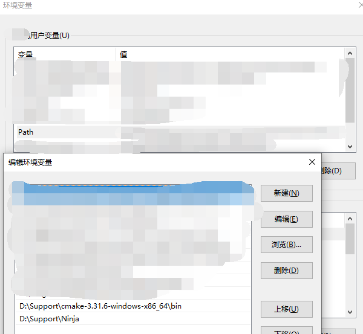
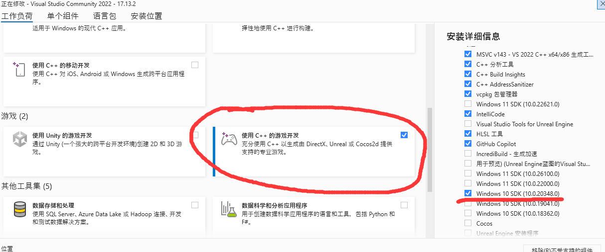
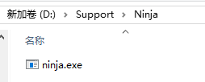
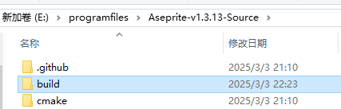
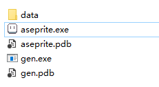
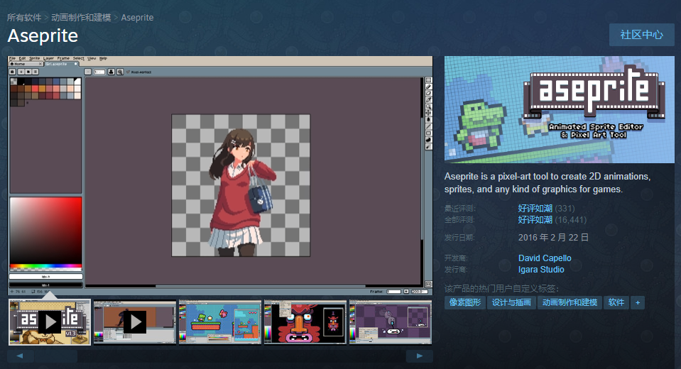

# Aseprite编译方法
方法出处：

[Build Aseprite in 2025 for free](https://www.youtube.com/watch?v=Ki-qvNx6CaU)

[aseprite-INSTALL.md](./INSTALL.md)

[网页端INSTALL](https://github.com/aseprite/aseprite/blob/main/INSTALL.md)

## 准备工作
### 下载aseprite项目文件
[aseprite项目仓库地址https://github.com/aseprite/aseprite](https://github.com/aseprite/aseprite)
在[Releases](https://github.com/aseprite/aseprite/releases)中下载`Aseprite v1.3.13`的源码`Aseprite-v1.3.13-Source.zip`并解压。

### 安装CMake
[下载地址https://cmake.org/download/](https://cmake.org/download/)
1. 选择适合的版本和安装包，本次使用了windows10 64位系统，下载了64位免安装压缩包[Windows x64 ZIP](https://github.com/Kitware/CMake/releases/download/v3.31.6/cmake-3.31.6-windows-x86_64.zip)。下载完成后解压(本人解压到了D:\\Support\\ 文件夹下)
2. 设置环境变量(如果是安装版，则需勾选`Add CMake to the PATH environment variable`)
`设置->关于->高级系统设置->环境变量`，找到`Path`变量，添加CMake的路径

### 安装Visual Studio 2022 + windows10SDK最新版
下载[Visual Studio 2022 https://visualstudio.microsoft.com/zh-hans/vs/](https://visualstudio.microsoft.com/zh-hans/vs/)，勾选`使用C++的游戏开发`，在安装详细信息中勾选`windows 10 SDK(10.0.20348.0)`

### 安装Ninja
[Ninja仓库地址https://github.com/ninja-build/ninja/releases](https://github.com/ninja-build/ninja/releases)
下载完毕后解压(本人解压到了D:\\Support\\Ninja 文件夹下)


随后将Ninja添加到环境变量中，如安装CMake步骤中所示

### 下载Skia
1. 下载对应系统版本的Skia，[Skia releases地址https://github.com/aseprite/skia/releases](https://github.com/aseprite/skia/releases)本人环境是windows64位，所以下载了`Skia-Windows-Release-x64.zip`
注意：由于准备编译的版本是`Aseprite v1.3.13`,应该下载`Skia-m102`,请不要下载`Skia-m124 (only for Aseprite beta branch)`
2. 解压Skia(本人解压到了D:\\Support\\ 文件夹下)

## Build aseprite项目
1. 进入aseprite项目文件中，创建一个名为`build`的文件夹

2. 进入build文件夹，打开cmd，输入下列代码(如果visualstudio2022没有安装在默认路径，请改为)
```bat
"C:\Program Files\Microsoft Visual Studio\2022\Community\Common7\Tools\VsDevCmd.bat" -arch=x64
:: 如果visualstudio2022没有安装在默认路径，请改为[Visual studio 2022路径]\Community\Common7\Tools\VsDevCmd.bat
```
3. 步骤2完成后，cmd控制台输入应该如下所示
```
**********************************************************************
** Visual Studio 2022 Developer Command Prompt v17.13.2
** Copyright (c) 2022 Microsoft Corporation
**********************************************************************
```
4. 执行CMake指令
```bat
cmake -DCMAKE_BUILD_TYPE=RelWithDebInfo -DLAF_BACKEND=skia 
-DSKIA_DIR=[你的skia目录]
-DSKIA_LIBRARY_DIR=[你的skia目录]\out\Release-x64 
-DSKIA_LIBRARY=[你的skia目录]\out\Release-x64\skia.lib -G Ninja ..

:: 如果你和我一样将文件都放在了D:\Support\目录下则执行
cmake -DCMAKE_BUILD_TYPE=RelWithDebInfo -DLAF_BACKEND=skia -DSKIA_DIR=D:\Support\Skia-Windows-Release-x64 -DSKIA_LIBRARY_DIR=D:\Support\Skia-Windows-Release-x64\out\Release-x64 -DSKIA_LIBRARY=D:\Support\Skia-Windows-Release-x64\out\Release-x64\skia.lib -G Ninja ..
```
注意：不要漏了最后的` ..`

5. 执行成功则会出现如下提示
```bat
-- Configuring done (123.0s)
-- Generating done (0.4s)
-- Build files have been written to: E:/programfiles/Aseprite-v1.3.13-Source/build
```
6. 执行Ninja
```bat
ninja aseprite
```
注意：如果执行过程中出现`warning C4819: 该文件包含不能在当前代码页(936)中表示的字符。请将该文件保存为 Unicode 格式以防止数据丢失`。一般不影响项目的build，如果在意有以下解决方法(方法来源：[知乎](https://zhuanlan.zhihu.com/p/652933963))：
- 1.将源文件以Unicode格式保存
找到出现warning的文件，我这里提示的是`D:\Support\Skia-Windows-Release-x64\third_party\externals\harfbuzz\src\hb-style.h`
用编辑器打开后另存为utf-8的格式(注意备份原文件)，替换文件后即可
- 2.修改`CMakeLists`,在项目目录下有个`CMakeLists.txt`文件，打开在非注释的地方加入下列代码保存重新从步骤1开始即可(需要删除build文件夹下的文件从头来一遍)
```
add_compile_options("/source-charset:utf-8")
```
本人直接加在了开头
```
# Aseprite
# Copyright (C) 2018-2024  Igara Studio S.A.
# Copyright (C) 2001-2018  David Capello

cmake_minimum_required(VERSION 3.16)

add_compile_options("/source-charset:utf-8") 

set(CMAKE_CXX_STANDARD 17)
set(CMAKE_CXX_STANDARD_REQUIRED ON)
set(CMAKE_CXX_EXTENSIONS OFF) # We use -std=c++17 instead of -std=gnu++17 in macOS
set(CMAKE_MSVC_RUNTIME_LIBRARY "MultiThreaded$<$<CONFIG:Debug>:Debug>")

if(NOT CMAKE_BUILD_TYPE)
  set(CMAKE_BUILD_TYPE RelWithDebInfo CACHE STRING
      "Choose the type of build, options are:
        None Debug Release RelWithDebInfo Profile."
      FORCE)
endif()

set(CMAKE_USER_MAKE_RULES_OVERRIDE ${CMAKE_CURRENT_SOURCE_DIR}/laf/cmake/c_flag_overrides.cmake)
set(CMAKE_USER_MAKE_RULES_OVERRIDE_CXX ${CMAKE_CURRENT_SOURCE_DIR}/laf/cmake/cxx_flag_overrides.cmake)

```
- 3.修改系统编码格式(不推荐)
- 4.将源文件里不能用GB2312表示的字符给删了(不推荐)

## 获得aseprite
执行完上述步骤后，build完的aseprite在`Aseprite-v1.3.13-Source\build\bin`下

你可以将bin复制到你喜欢的地方然后重命名为aseprite，给aseprite.exe创建快捷方式并放到桌面。
## 完成
恭喜你，到这里你已经获得了aseprite
接下来执行`aseprite.exe`，开始你的创作吧！

## 注意
根据aseprite的[End-User License Agreement for Aseprite (EULA)](https://github.com/aseprite/aseprite/blob/main/EULA.txt)，编译出的软件只能个人使用，请不要分享。
如果有能力的话，可以去[steam](https://store.steampowered.com/app/431730/Aseprite/)购买来支持作者。

